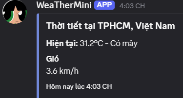

# 🌤️ WeatherBot - Discord Weather Forecast Bot

[](https://dotnet.microsoft.com/)
[](https://dsharpplus.github.io/)
[](https://dotnet.microsoft.com/)

Một bot Discord hiện đại cung cấp dự báo thời tiết chính xác cho mọi thành phố trên thế giới, sử dụng **slash commands** và API miễn phí.

## ✨ Tính năng

- Lệnh `/weather` hiện đại với autocomplete thành phố
- Dữ liệu thời tiết realtime từ **Open-Meteo API** (không cần API key)
- Embed đẹp mắt với nhiệt độ, mô tả, tốc độ gió
- Cấu hình an toàn bằng `appsettings.json`
- Code sạch, dễ mở rộng

## 🖼️ Demo

![Bot Demo]
  

## 🚀 Cách chạy

```bash
git clone https://github.com/ngocngoccm1/WeatherMini.git
cd WeatherBot
dotnet run